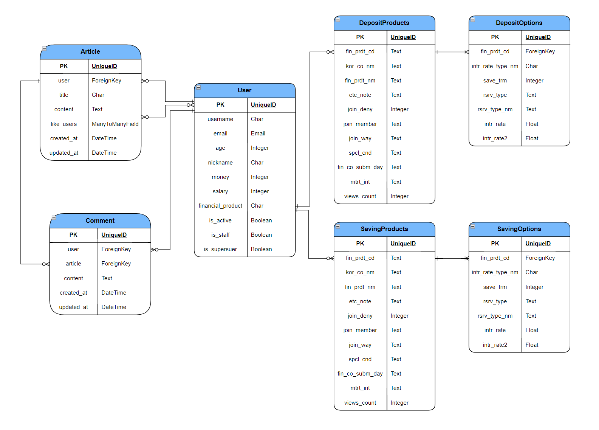

### 🐘 개요

- 일시 : 2023.11.16(목) ~ 2023.11.24(금)
- 주제 : 예적금 상품 비교 및 추천 웹 사이트
- 서비스명 : 우리끼리

### **🐣 팀원**

| 이름   | 담당 영역                                 | Github                      |
| ------ | ----------------------------------------- | --------------------------- |
| 박정환 | 백엔드(Django), 프론트엔드(Vue), CSS 작업 | https://github.com/Nam4o    |
| 안유나 | 백엔드(Django), 프론트엔드(Vue)           | https://github.com/YUNA-AHN |

### 🎯개발목표

- 금융상품 데이터 기반 예금 및 적금 금리 비교 서비스 구성
- 금융 상품 추천 알고리즘 구성
- 환율 정보 API를 활용한 실시간 환율 계산기 서비스 구성
- 카카오맵 API를 활용한 은행 검색 서비스 구성
- 커뮤니티 서비스 구성

### ✏️개발 계획

|                   | Front-End                                                                                                                                    | Back-End                                                         |
| ----------------- | -------------------------------------------------------------------------------------------------------------------------------------------- | ---------------------------------------------------------------- |
| 메인 페이지       | - 메인페이지 레이아웃 및 디자인 CSS                                                                                                          | -                                                                |
| 회원 커스터마이징 | - 회원가입 및 로그인/로그아웃 화면 구현   - 회원/비회원에 따라 제공되는 서비스를 다르게 구현   - 사용자 편의를 위한 아이디 저장 기능 | - 회원가입 및 로그인/로그아웃 기능                               |
| 예적금 금리 비교  | - 금융 상품 정보 제공 화면 구현   - 원하는 조건에 따른 상품 조회 기능 구현   - 상품 상세 정보 화면 구현   - 가입하기 기능 구현   | - API를 활용한 금융 상품 정보 DB 저장   - 상품 가입하기 기능 |
| 환율 계산기       | - 두나무 API를 활용하여 환율 정보 수집   - 환율 계산기 기능 구현                                                                         | -                                                                |
| 은행 검색 지도    | - Kakao 맵 API를 활용하여 화면 구현  - 키워드에 맞는 검색 결과 구현 - 카카오 맵에 장소 정보 표시                                         | -                                                                |
| 커뮤니티          | - 게시판 CRUD 페이지 CSS  - 글 작성 및 게시글 리스트 카테고리 표시  - 게시글 검색 기능 구현                                          | 게시글 및 댓글 CRUD 기능 구현                                    |
| 프로필            | - 회원 프로필 수정 기능 구현   - 회원 활동 내역 정보 제공 화면 구현   - chartjs를 활용한 가입 상품 금리 비교                         | -금융상품 추천 알고리즘 구현                                     |

### ✅필수 요구사항

| No. | 구분                    | 기능                                              | 구현 정도(⭐⭐⭐⭐⭐) |
| --- | ----------------------- | ------------------------------------------------- | --------------------- |
| 1   | 메인 페이지             | HomeView 구성                                     | ⭐⭐⭐⭐              |
| 2   | 회원 커스터마이징       | 회원 가입, 로그인, 로그아웃                       | ⭐⭐⭐⭐⭐            |
| 3   | 예적금 금리 비교        | 예적금 키워드 별 데이터 전체 조회                 | ⭐⭐⭐⭐              |
|     |                         | 예적금 상품 상세조회                              | ⭐⭐⭐⭐⭐            |
| 4   | 환율 계산기             | 환율 데이터 조회 및 환율 변환 계산기(양방향) 구현 | ⭐⭐⭐⭐              |
| 5   | 근처 은행 검색          | 카카오 맵을 활용하여 은행 위치 검색               | ⭐⭐⭐⭐              |
| 6   | 커뮤니티(게시판)        | 게시글 및 댓글 CRUD                               | ⭐⭐⭐⭐⭐            |
| 7   | 프로필                  | 회원의 기본 정보 출력 및 수정                     | ⭐⭐⭐⭐              |
| 8   | 금융 상품 추천 알고리즘 | 1개 이상의 금융상품 추천                          | ⭐⭐⭐                |

### 💻 데이터베이스 모델링(ERD)

### ✍개발일지

|          | 박정환                                                                                                                                                      | 안유나                                                                                                                     |
| -------- | ----------------------------------------------------------------------------------------------------------------------------------------------------------- | -------------------------------------------------------------------------------------------------------------------------- |
| 23-11-16 | - 프로젝트 구상 및 컨셉 아이디어 회의   - 프로젝트 구상, 컴포넌트 제작, erd   - 카카오 맵, 금융상품 API 테스트   - 로그인 및 회원가입 기능 시작 | - 프로젝트 구상 및 컨셉 아이디어 회의   - 프로젝트 구상, 컴포넌트 제작, erd - 환율 API 테스트   - 환율 계산기 시작 |
| 23-11-17 | - 로그인, 회원가입 기능 구현   - 금융 상품 비교 기능 구현 시작   - 금융 데이터 DB저장                                                               | - 환율 계산기 기능 구현                                                                                                    |
| 23-11-18 | - 금융 상품 상세 정보 화면 구현                                                                                                                             | - 게시판 기능 구현 시작   - 게시글 생성 삭제 기능 구현                                                                 |
| 23-11-19 | - 카카오 맵을 활용한 영업점 찾기 기능 구현   - CSS 시작                                                                                                 | - 댓글 생성 삭제 기능 구현   - 게시글 수정 기능 구현 시작                                                              |
| 23-11-20 | - 카카오 맵 키워드 검색 결과 화면 구현   - 로그인 세션 유지 및 로그아웃 기능 추가                                                                       | - 프로필 페이지 구현 시작                                                                                                  |
| 23-11-21 | - 게시글 수정 기능 디버깅   - CSS 보완                                                                                                                  | - 게시판 기능 디버깅 및 보완  - 게시판 좋아요 기능 구현                                                            |
| 23-11-22 | - 금융 상품 가입하기 기능 구현 시작   - 네비게이션 가드 설정   - CSS 보완                                                                           | - 회원 정보 수정 및 비밀번호 변경 기능 구현   - 사용자 활동 내역 정보 제공 기능   - 네비게이션 가드 설정           |
| 23-11-23 | - 상품 가입하기 기능 구현   - 부트스트랩을 이용한 캐러셀 제작  - CSS 보완   - 발표 구상 및 준비                                                 | - 금융 상품 추천 알고리즘 구현   - 발표 구상 및 준비                                                                   |
| 23-11-24 | - 최종 점검 및 발표                                                                                                                                         | - 최종 점검 및 발표                                                                                                        |

### 🤬 trouble shooting

| Name   | Content                                                                                                                  | **해결 여부**(Y/N) | **해결 과정**                                                                                    |
| ------ | ------------------------------------------------------------------------------------------------------------------------ | ------------------ | ------------------------------------------------------------------------------------------------ |
| 박정환 | 비동기작업 처리 특성으로 undefined 값들이 출력                                                                           | Y                  | 컴포넌트 내에서 computed 를 통해 값을 갱신하고 라이프사이클 훅 메서드 들을 이용하여 해결         |
|        | 로그아웃 시도 시, localStorage 의 데이터들을 삭제하지만, 새로고침을 시행하지 않아 로그아웃 완료된 페이지를 나타내지 않음 | Y                  | router push 를 진행하기 전, router.go(0) 을 통해 현재 페이지를 한번 갱신하여 해결                |
| 안유나 | 비동기 처리로 정보를 받아오면서 데이터를 정의해두었지만 null값이 반환되어 사용할 수 없는 문제 발생                       | Y                  | 비동기 처리에 대한 개념을 다시 한 번 이해해보고, 비동기 처리하면서 데이터를 입력해주며 문제 해결 |
|        | 금융 상품 추천 알고리즘을 작성하는 과정에서 QuerySet을 활용에 미숙하여 참조키를 활용한 조건을 걸지 못하는 문제 발생      | N                  | 관련 문법에 대해 다시 학습해보았지만, 시간 부족으로 인해 원하는 조건을 추가하지 못한 채 마무리   |

### 💡서비스 구현

| No  | 구분              | 기능                                             | 구현 정도(⭐⭐⭐⭐⭐) |
| --- | ----------------- | ------------------------------------------------ | --------------------- |
| 1   | 메인 페이지       | 메인페이지 레이아웃 및 디자인 CSS                | ⭐⭐⭐⭐              |
| 2   | 회원 커스터마이징 | 회원가입 및 로그인/로그아웃 기능                 | ⭐⭐⭐⭐⭐            |
| 3   |                   | 회원가입 및 로그인/로그아웃 화면 구현            | ⭐⭐⭐⭐⭐            |
| 4   |                   | 회원/비회원에 따라 제공되는 서비스를 다르게 구현 | ⭐⭐⭐⭐⭐            |
| 5   | 예/적금 금리 비교 | API를 활용한 금융 상품 정보 DB 저장              | ⭐⭐⭐⭐⭐            |
| 6   |                   | 금융 상품 가입하기 기능                          | ⭐⭐⭐⭐⭐            |
| 7   |                   | 금융 상품 정보 제공 화면 구현                    | ⭐⭐⭐⭐⭐            |
| 8   |                   | 상품 상세 정보 화면 구현                         | ⭐⭐⭐⭐              |
| 9   |                   | 카테고리별 검색 기능                             | ⭐⭐⭐⭐⭐            |
| 10  | 환율 계산기       | 두나무 API를 활용하여 데이터 수집                | ⭐⭐⭐⭐⭐            |
| 11  |                   | 환율 계산기 기능 구현                            | ⭐⭐⭐⭐              |
| 12  | 은행 검색 지도    | API를 활용하여 Kakao 맵 화면 구현                | ⭐⭐⭐⭐⭐            |
| 13  |                   | 키워드에 맞는 검색 결과 구현                     | ⭐⭐⭐⭐⭐            |
| 14  |                   | 카카오에 장소 정보 표시                          | ⭐⭐⭐⭐              |
| 15  | 커뮤니티          | 게시글 및 댓글 CRUD 기능 구현                    | ⭐⭐⭐⭐⭐            |
| 16  |                   | 게시판 CRUD 페이지 CSS                           | ⭐⭐⭐⭐⭐            |
| 17  | 프로필            | 추천 금융상품 알고리즘 구현                      | ⭐⭐⭐                |
| 18  |                   | 회원 프로필 수정 기능 구현                       | ⭐⭐⭐⭐⭐            |
| 19  |                   | 가입 상품 조회 화면 구현                         | ⭐⭐⭐⭐⭐            |
| 20  |                   | 작성한 게시글, 댓글, 좋아요한 게시글 조회        | ⭐⭐⭐⭐⭐            |

### 🍀 배운점 및 느낀점

### 박정환

수많은 undifined 와 싸웠다. 라이프 싸이클 훅 (`onMounted`) 과 비동기 작업의 특성상 시간이 오래 걸리는 작업은 비교적 나중에 완료되기 때문에 컴포넌트 내에서 선언한 const 들을 computed 를 통해 값을 갱신하지 않으면 undefined 혹은 null 로 출력되는 에러를 정말 많이 겪었다.
user 모델의 serializer 와 models 의 financial_products 필드를 리스트 필드 시리얼라이저로 받아오려했는데 이에 어려움을 겪고 char 필드를 통해 값들을 받아오고 현재 유저 정보의 financial_products 의 하나의 문자열 형태로 표현된 값들 ex) "정기예금1, 정기예금2, " 가져와 문자열로 뒤에 가입상품을 추가하는 형식으로 대체하였다.

로그아웃 기능을 수행할 때 새로고침을 진행하지않는 `router` 특성상 로그아웃을 하고 `router push` 로 메인페이지로 이동할 때, 로그아웃이 완전히 이루어지지 않는 상황이 있었다. 이는 `router.go(0)` 를 통하여 문제를 해결하였다.

카카오 맵 API 를 통해 근처 은행 검색하는 과정에서 처음에는 select option 로 선택된 지역의 위도와 경도 정보를 기준으로 은행이름을 keyword 로 하여 검색을 진행하도록 하려했는데, 타인의 조언으로 지역이름과 은행이름을 하나의 키워드로 합쳐 검색하는 방법이 있다는 것을 깨달았다. 이 말을 듣고보니 우리가 평소에 지도 검색창에 ex) 구미 대구은행 과 같은 형식으로 검색하여도 결과가 출력되는 사실을 떠올렸다.

이번 프로젝트를 진행하면서 데이터를 저장하고, 가공하고, 출력하는 작업에서 정말 많은 충돌을 겪었지만, 하나 하나씩 파고들며 꾸준히 수정해나가면서 조금씩 지식이 쌓이는 것을 느꼈다. ex) 컴포넌트 내에서 갱신되지 않은 값들에 대한 `computed` 와 `mounted` 사용
그리고 특히, 학기 초반에 css 작업이 정말 많이 어려웠지만, 이번 프로젝트를 통해 어떤 요소들을 어떻게 묶고, 선택자를 어떤 방식으로 사용하면 특정 요소에만 스타일을 적용할 수 있는지 잘 알게 되었고, 디자인적으로 더 많은 요소들을 추가하고 싶은 욕심도 생겼다.

### 안유나

실습실 문제를 푸는 것과는 너무나도 다른 문제였다. 분명히 배운 내용인데 막상 사용하려고 보니 제대로 이해하지 못하고 넘어갔던 부분이 발목을 잡았다. 수업시간에 배웠던 내용들을 복기하면서 새로운 기능을 구현해나가는 것이 힘들기도 했지만, 내 눈으로 내가 만든 것이 굴러가는 것을 보는 것은 즐거웠다.

우리 프로젝트 뿐만 아니라, 다른 친구들이 프로젝트를 진행하는 과정을 지켜보면서 많을 것을 배울 수 있었다.

시간이 많을 것이라고 생각하진 않았지만, 그렇다고 해서 부족할 것이라고 생각하지 못했는데 시간 부족으로 구현하지 못한 기능에 아쉬움이 남는다. 다음 프로젝트에서는 시간 관리 능력을 키워 원하는 기능을 모두 구현해보고 싶다.

프로젝트를 진행하면서 뜻대로 되지 않아 많이 답답하기도 하고, 속상하기도 했는데 유능한 페어와 반 친구들의 도움으로 잘 해낼 수 있었다! 많이 부족했는데 잘 이끌어준 팀장에게 감사를! 전합니다!
